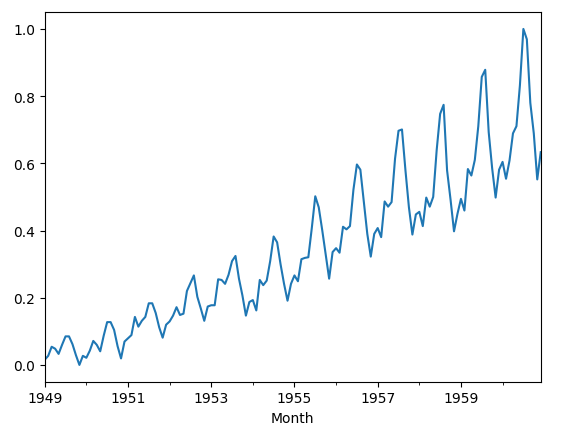
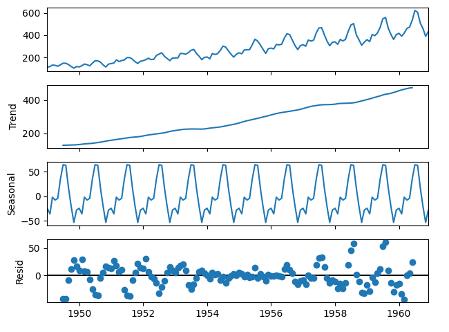
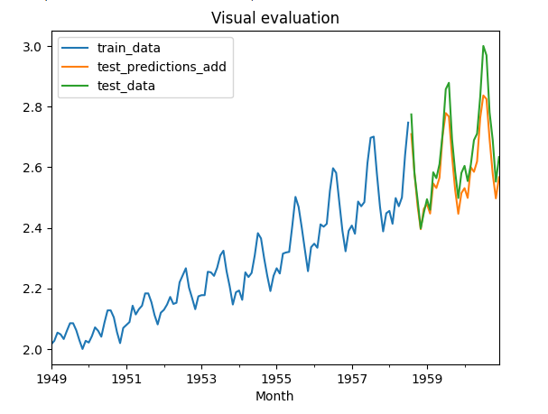
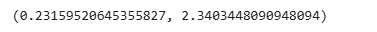
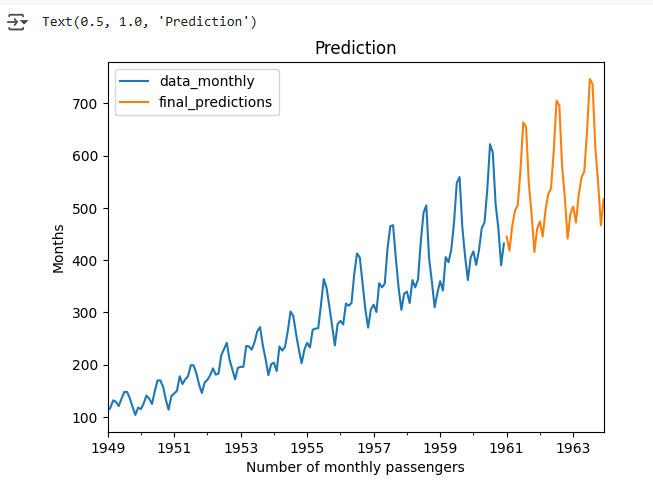

## Devloped by: Sreevalsan V
## Register Number: 212223240158
## Date: 5-03-2025

# Ex.No: 6                   HOLT WINTERS METHOD

### AIM:
To implement the Holt Winters Method Model using Python.

### ALGORITHM:
1. You import the necessary libraries
2. You load a CSV file containing daily sales data into a DataFrame, parse the 'date' column as datetime, set it as index, and perform some initial data exploration
3. Resample it to a monthly frequency beginning of the month
4. You plot the time series data, and determine whether it has additive/multiplicative trend/seasonality
5. Split test,train data,create a model using Holt-Winters method, train with train data and Evaluate the model  predictions against test data
6. Create teh final model and predict future data and plot it

### PROGRAM:

Importing necessary modules

```py
import pandas as pd
import matplotlib.pyplot as plt
from statsmodels.tsa.holtwinters import ExponentialSmoothing
from sklearn.preprocessing import MinMaxScaler
from sklearn.metrics import mean_absolute_error, mean_squared_error
```

Load the dataset,perform data exploration
```py
data = pd.read_csv('/content/AirPassengers.csv', parse_dates=['Month'],index_col='Month')

data.head()
```

Resample and plot data

```py
data_monthly = data.resample('MS').sum()   #Month start

data_monthly.head()

data_monthly.plot()
```

Scale the data and check for seasonality

```py
scaler = MinMaxScaler()
scaled_data = pd.Series(scaler.fit_transform(data_monthly.values.reshape(-1, 1)).flatten(),index=data_monthly.index)

scaled_data.plot() # The data seems to have additive trend and multiplicative seasonality

from statsmodels.tsa.seasonal import seasonal_decompose
decomposition = seasonal_decompose(data_monthly, model="additive")
decomposition.plot()
plt.show()
```

Split test,train data,create a model using Holt-Winters method, train with train data and Evaluate the model predictions against test data

```py
scaled_data=scaled_data+1 # multiplicative seasonality cant handle non postive values, yes even zeros
train_data = scaled_data[:int(len(scaled_data) * 0.8)]
test_data = scaled_data[int(len(scaled_data) * 0.8):]

model_add = ExponentialSmoothing(train_data, trend='add', seasonal='mul').fit()

test_predictions_add = model_add.forecast(steps=len(test_data))

ax=train_data.plot()
test_predictions_add.plot(ax=ax)
test_data.plot(ax=ax)
ax.legend(["train_data", "test_predictions_add","test_data"])
ax.set_title('Visual evaluation')

np.sqrt(mean_squared_error(test_data, test_predictions_add))

np.sqrt(scaled_data.var()),scaled_data.mean()

```

Create teh final model and predict future data and plot it

```py

final_model = ExponentialSmoothing(data_monthly, trend='add', seasonal='mul', seasonal_periods=12).fit()

final_predictions = final_model.forecast(steps=int(len(data_monthly)/4)) #for next year

ax=data_monthly.plot()
final_predictions.plot(ax=ax)
ax.legend(["data_monthly", "final_predictions"])
ax.set_xlabel('Number of monthly passengers')
ax.set_ylabel('Months')
ax.set_title('Prediction')

```

### OUTPUT:
 
 Scaled_data plot:

 

Decomposed plot:



Test prediction:



Model performance metrics:

RMSE:


Standard deviation and mean:



Final prediction:



### RESULT:
Thus the program run successfully based on the Holt Winters Method model.
